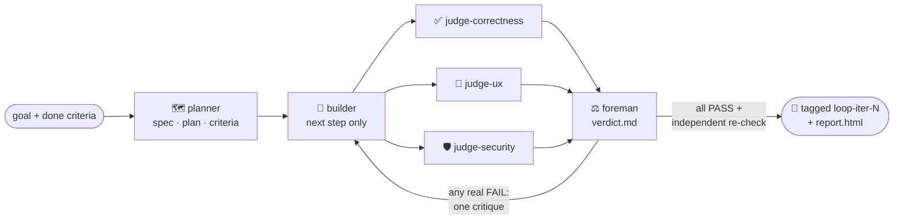

<div align="center">


### An autonomous plan → build → judge loop for Claude Code.


<a href="LICENSE"></a>

[Install](#-install) · [How it works](#-how-it-works) · [Commands](#-commands) · [Modules](#-the-ten-modules)

</div>

---

Based on Anthropic's harness / "loop engineering" pattern. A **planner** writes a verifiable spec, a
**builder** makes incremental progress, and a **jury of separate judges** actually exercises the artifact
until every acceptance criterion passes. **The builder never grades its own work.**

## 🚀 Install

```
/plugin marketplace add P-Khodadust/crucible
/plugin install crucible@crucible-marketplace
```

Or run a local clone for one session: `claude --plugin-dir ./crucible`. Pick up edits with
`/reload-plugins`; validate with `claude plugin validate ./crucible --strict`.

Then give it a goal and a definition of done:

```
/crucible:loop build a todo app with add / complete / delete; done = npm test passes and the three actions work in the browser  max=12 approve
```

## 🔁 How it works



1. **Planner** detects your stack and writes `.loop/spec.md` (requirements, **Stack & Commands**, numbered
   *verifiable* acceptance criteria), `.loop/plan.md` (small steps) and `.loop/progress.md`.
2. **Builder** does the next task only, runs the recorded build/test/lint, and logs failed approaches (with
   reasons) so they're never retried.
3. **Jury**: three fresh, skeptical specialists run **in parallel**: `judge-correctness` (tests, build,
   behavior), `judge-ux` (usability, empty and error states) and `judge-security` (validation, secrets,
   injection/authz). Each verifies with real evidence (runs commands; drives the browser via Playwright) and
   reports per-criterion PASS/FAIL **with a confidence level**, but can't edit code.
4. **Foreman** aggregates them into `.loop/verdict.md`: a criterion passes only if no judge found a real
   failure; conflicts and low-confidence calls are flagged; one consolidated critique goes back to the builder.
5. The loop repeats until an **all-PASS** verdict is confirmed by an independent re-check, or a cap or stall
   stops it. Then it writes an HTML report.

## ⌨️ Commands

| Command | What it does |
|:--|:--|
| `/crucible:loop` | Full autonomous loop (plan → build → jury → repeat) |
| `/crucible:loop-plan` | Plan only: write and print the spec/criteria, then stop |
| `/crucible:loop-judge` | Run the jury once against the current state (no building), a manual re-check |
| `/crucible:loop-resume` | Continue an in-progress loop from `.loop/` state |

> Subcommands are flat command files, so they read as `loop-plan` / `loop-judge` / `loop-resume`
> (Claude Code plugin commands don't nest into `loop:plan`-style names).

**Arguments** for `/crucible:loop`: `[goal + done-criteria] [max=N] [time=30m] [bestof=N] [approve]`

| Argument | Meaning |
|:--|:--|
| `max=N` | Iteration cap (default 10) |
| `time=30m` | Wall-clock cap (`s`/`m`/`h`); stops cleanly when hit |
| `bestof=N` | **N competing builders** in parallel worktrees per step; the jury picks the winner (git only; multiplies cost, best for hard or subjective steps) |
| `approve` | Pause after planning so you can approve or edit the spec **before** building spends tokens |

## 🧩 The ten modules

| # | Module | What you get |
|:-:|:--|:--|
| 1 | **Judge jury + foreman** | Parallel correctness / UX / security judges with confidence aggregation (`agents/judge-*.md`) |
| 2 | **Git checkpoints + worktrees** | Each iteration builds in a worktree; all-PASS verdicts are committed and tagged `loop-iter-N` (`hooks/`). Restore with `git checkout loop-iter-N` |
| 3 | **Budget guardrails + status line** | `max`/`time` caps tracked in `.loop/budget.json`; live progress on subagent rows (`settings.json`) |
| 4 | **Approval gate + escalation** | `approve` flag; on a stall the loop asks you how to proceed instead of failing silently |
| 5 | **Visual regression + HTML report** | Jury screenshots in `.loop/screens/iter-N/`; `.loop/report.html` with timeline, criteria table, UI thumbnails and failed approaches |
| 6 | **Best-of-N builders** | `bestof=N` (opt-in, expensive) |
| 7 | **Cross-project lessons** | `~/.crucible/LESSONS.md`, read by the planner, appended on repeated failures |
| 8 | **Regression monitor** *(experimental)* | Where the host supports plugin monitors, `monitors/` re-runs the recorded test on each new commit and warns on regressions. Monitors are shell-only and can't run the jury, so the guaranteed re-check is `/crucible:loop-judge` (+ `loopctl baseline`) |
| 9 | **Auto stack detection** | The planner picks build/test/lint/run commands and the verification approach, and records them in `.loop/spec.md` |
| 10 | **Subcommands** | `/crucible:loop-plan`, `/crucible:loop-judge`, `/crucible:loop-resume` |

## 📋 Requirements & notes

- **Ponytail (on by default).** Crucible declares the [ponytail](https://github.com/DietrichGebert/ponytail)
  plugin as a dependency and preloads its minimal-code skill into the builder, so generated code is YAGNI /
  reuse-first (never at the cost of validation, security or accessibility). It auto-installs with crucible
  when ponytail's marketplace is registered; if not, add it once: `/plugin marketplace add DietrichGebert/ponytail`.
- **Playwright MCP** (bundled) drives the browser for web verification; needs Node 18+ and a browser.
- **Git** enables checkpoints, worktree isolation and `bestof>1`. Without git the loop runs in place and
  warns once.
- **Strong model:** the judges are pinned to `model: opus`. Run the loop on a strong model overall for best
  results.
- **Status line:** uses `${CLAUDE_PLUGIN_ROOT}` in `settings.json`. If your build doesn't substitute it
  there, the subagent status line just won't render (budget tracking is unaffected); replace it with an
  absolute path to `scripts/subagent-status.mjs`, or delete `settings.json`.
- After installing or editing the plugin, run **`/reload-plugins`** (or restart).

<details>
<summary><b>✂️ Trim to save context</b></summary>

Every agent and command adds always-on context. Cleanly removable:

- **Regression monitor:** delete `monitors/`.
- **Status line:** delete `settings.json` + `scripts/subagent-status.mjs`.
- **HTML report:** delete `scripts/report.mjs` (drop the report line in `commands/loop.md` Step 4).
- **Checkpoints:** delete `hooks/`.
- **A judge lens** (e.g. security): delete `agents/judge-security.md` and remove it from the two spawn lists
  in `commands/loop.md` and `commands/loop-judge.md`.
- **A subcommand:** delete its `commands/loop-<name>.md` file.
- **Ponytail default:** remove the `dependencies` entry in `.claude-plugin/plugin.json` and the `skills:` line
  in `agents/builder.md`.

The core loop needs `commands/loop.md`, `agents/{planner,builder,judge-correctness,judge-foreman}.md` and
`scripts/loopctl.mjs`.
</details>

## 📄 License

[MIT](LICENSE)
